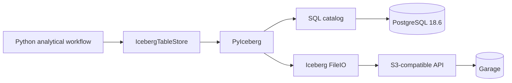

# Iceberg analytical tables

Milestone 3 Phase 4 adds an analytical table layer without changing the two platform boundaries already established for object storage and operational run metadata.

## Architecture



PostgreSQL contains Iceberg catalog state. Table data, manifests, and Iceberg metadata files live under the S3 warehouse. The analytical data path therefore does not store bulk data in PostgreSQL.

## Local smoke

Start PostgreSQL and Garage, then load the development S3 credentials:

```bash
docker compose up -d --wait postgres
sh infra/garage/bootstrap.sh
. infra/garage/dev.env
```

Run the table smoke:

```bash
cd python
poetry install
poetry run data-platform-lab iceberg
```

The smoke creates `analytics.events_smoke`, appends one Arrow record, scans the table through PyIceberg, and requires the row to be visible.

## Catalog and warehouse

The local defaults are:

```text
catalog:   platform
catalog DB: PostgreSQL
warehouse: s3://data-platform-lab/iceberg
S3 API:    http://localhost:3900
```

The SQL catalog and S3 warehouse are independently replaceable infrastructure choices. Production deployments can point the same application boundary at another PostgreSQL-compatible catalog database and an S3 endpoint with real credentials.

## Scope

This phase deliberately starts in Python because PyIceberg is the mature native library used for the live Iceberg contract. JavaScript remains part of the surrounding platform, but Phase 4 does not invent a second Iceberg implementation with weaker ecosystem support.
