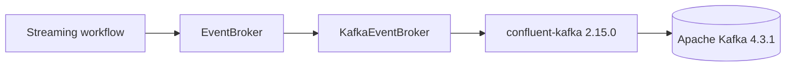

# Kafka event broker

Milestone 3 Phase 5 adds a transport boundary for durable event delivery without moving event-time or validation semantics into the broker adapter.

## Architecture



The contract transports opaque byte payloads plus optional byte keys. JSON decoding, validation, deduplication, watermarking, lateness classification, and downstream persistence remain application responsibilities.

## Local validation

Start Kafka and run the smoke command:

```bash
docker compose up -d --wait kafka
docker compose exec -T kafka /opt/kafka/bin/kafka-topics.sh \
  --bootstrap-server localhost:9092 \
  --create --if-not-exists \
  --topic data-platform-lab-smoke \
  --partitions 1 \
  --replication-factor 1
cd python
poetry install --no-interaction
poetry run data-platform-lab broker
```

The smoke publishes a keyed JSON payload, consumes it through a fresh consumer group using `auto.offset.reset=earliest`, and verifies that both key and value round-trip unchanged.

## Scope

This phase proves the broker transport contract. Phase 6 will compose Kafka ingestion with the existing sensor-event processor, PostgreSQL run metadata, Garage object storage, and Iceberg analytical output into an end-to-end failure/recovery scenario.
