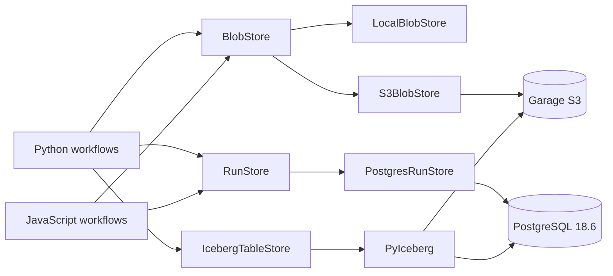

# Milestone 3 — Local data platform

Status: in progress

## Architectural rule

```text
workflow logic -> platform contracts -> local or infrastructure adapters
```

## Current platform architecture



## Sequence

1. storage and unified-command boundaries — complete;
2. S3-compatible storage and Garage integration — complete;
3. PostgreSQL-backed run/metadata store — complete;
4. Iceberg analytical tables over object storage — in progress;
5. event-broker adapter for streaming;
6. end-to-end platform failure/recovery demo.

Phase 3 reuses the existing observability `RunMetadata` shape. Phase 4 adds a PyIceberg SQL catalog in PostgreSQL while keeping Iceberg table data and metadata files in the S3-compatible Garage warehouse.

See [PostgreSQL run metadata](postgres-run-metadata.md) for the operational metadata layer and [Iceberg analytical tables](iceberg-analytical-tables.md) for the analytical-table architecture and local validation flow.
