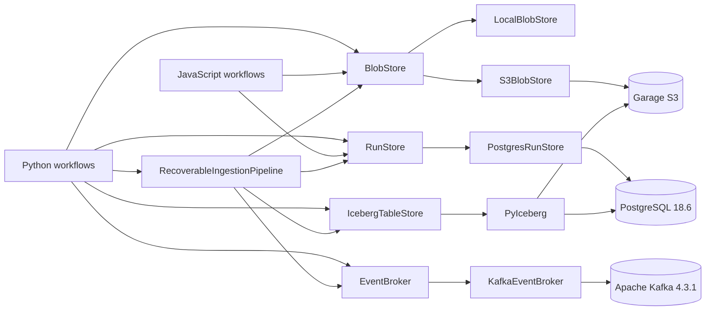

# Milestone 3 — Local data platform

Status: complete

## Architectural rule

```text
workflow logic -> platform contracts -> local or infrastructure adapters
```

## Current platform architecture



## Recovery sequence

```mermaid
sequenceDiagram
    participant K as Kafka
    participant C as Recovery coordinator
    participant P as PostgreSQL
    participant S as Garage S3
    participant I as Iceberg

    K->>C: consume uncommitted message
    C->>P: acquire broker-position advisory claim
    C->>P: save running run_id
    C->>S: put deterministic raw object
    C->>I: append ingestion_id if missing
    Note over C,I: injected crash may occur here
    C->>P: save success
    C->>K: commit offset + 1
    C->>P: release advisory claim

    Note over K,C: after a pre-ack crash, Kafka replays the same position
    K->>C: replay same topic/partition/offset
    C->>P: acquire same broker-position claim
    C->>S: replace same raw object key
    C->>I: ingestion_id already present; skip append
    C->>P: save success
    C->>K: commit offset + 1
    C->>P: release advisory claim
```

## Sequence

1. storage and unified-command boundaries — complete;
2. S3-compatible storage and Garage integration — complete;
3. PostgreSQL-backed run/metadata store — complete;
4. Iceberg analytical tables over object storage — complete;
5. event-broker adapter for streaming — complete;
6. end-to-end platform failure/recovery demo — complete.

Phase 3 reuses the existing observability `RunMetadata` shape. Phase 4 adds a PyIceberg SQL catalog in PostgreSQL while keeping Iceberg table data and metadata files in the S3-compatible Garage warehouse. Phase 5 adds a byte-oriented `EventBroker` contract with a real Apache Kafka adapter; event decoding and event-time semantics remain above the transport boundary. Phase 6 composes those boundaries with deterministic broker-position identities, a PostgreSQL advisory claim for concurrent serialization, explicit post-Iceberg failure injection, replay reconciliation, and acknowledgement only after durable recovery.

See [PostgreSQL run metadata](postgres-run-metadata.md), [Iceberg analytical tables](iceberg-analytical-tables.md), [Apache Kafka event broker](kafka-event-broker.md), and [Platform failure and recovery](platform-recovery.md) for the individual contracts and acceptance flows.
