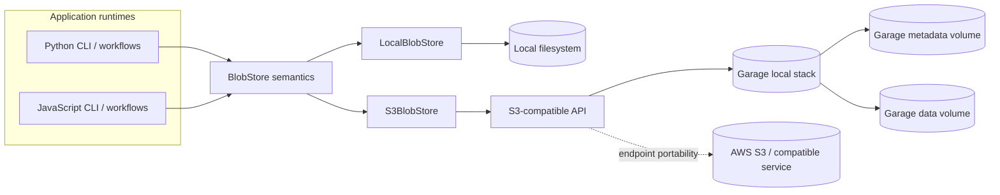
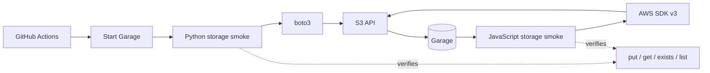

# Milestone 3 — Local data platform

Status: in progress

## Purpose

Milestone 2 proved the core data-engineering patterns with dependency-light,
local implementations. Milestone 3 turns those exercises into a small local
platform without discarding the educational implementations that make the
repository useful.

The architectural rule for M3 is:

```text
workflow logic -> platform contracts -> local or infrastructure adapters
```

Vendor clients must not become the application architecture.

## Platform architecture



The contract is the architectural seam. Local and remote storage are adapter
choices below workflow logic, not separate workflow implementations.

## Phase 1 — storage and command boundaries

Phase 1 replaced two placeholder areas with stable application boundaries.

### Unified command surface

Python and JavaScript expose one top-level command:

```text
data-platform-lab benchmark ...
data-platform-lab storage ...
data-platform-lab stream ...
data-platform-lab warehouse ...
```

The root command delegates to the workflow CLIs. It does not copy their
argument declarations, so configuration parsing remains owned by each workflow.

### Object-storage contract

Both runtimes implement the same minimal object-store semantics:

- put bytes by portable relative key;
- get bytes by key;
- test object existence;
- list objects by prefix in deterministic order;
- reject absolute paths and parent traversal;
- replace complete objects rather than mutating partial file contents.

Python formalises the boundary as a `BlobStore` protocol. `LocalBlobStore` is
the local reference adapter.

## Phase 2 — S3-compatible object storage

Phase 2 adds infrastructure without changing the storage contract.

### S3 adapters

Python provides `S3BlobStore`, backed by the official boto3 S3 client.
JavaScript provides `S3BlobStore` plus an AWS SDK v3 client factory. Both
adapters support:

- custom S3 endpoints;
- AWS Signature V4;
- path-style addressing for local S3-compatible services;
- a configurable bucket namespace prefix;
- paginated `ListObjectsV2` results;
- correct separation between a missing object and an authorization/service
  failure.

The adapters are endpoint-agnostic. The same application boundary can target
Garage locally, AWS S3, or another compatible service.

### Local S3 service

The Compose stack uses Garage for the local S3 endpoint. Garage is not an
application dependency; it is one implementation of the S3 protocol used for
local development and integration testing.

The local service is pinned to `dxflrs/garage:v2.3.0`. Garage v2.3.0 runs
with its native `--single-node --default-bucket` mode. The Compose service
supplies deterministic development-only credentials and the `data-platform-lab`
bucket, while the bootstrap script only starts the service and waits for the
S3 node to become healthy.

See [S3-compatible local storage](s3-object-storage.md) for commands and the
security boundary around the committed development credentials.

### Wire-level integration gate

Mocked unit tests exercise pagination, namespace mapping, object round trips,
and S3 error classification. A separate GitHub Actions workflow then validates
the real endpoint path:



This prevents a useful distinction from being lost: an adapter can satisfy its
unit-test double and still be wrong on the actual S3 wire protocol.

## M3 sequence

1. stable storage and command boundaries — complete;
2. S3-compatible object-store adapter and Docker Compose service — complete;
3. relational run/metadata store backed by PostgreSQL;
4. Iceberg analytical tables over object storage;
5. event-broker adapter for the streaming exercise;
6. end-to-end local platform demo and failure/recovery tests.

## Non-goals so far

- replacing the existing medallion filesystem examples;
- changing the statistical or business semantics of any workflow;
- introducing distributed execution;
- treating a single-node local object store as a production deployment;
- tying workflow modules directly to boto3, the AWS SDK, or Garage;
- duplicating child CLI configuration at the root command.

## Phase 2 acceptance criteria

Phase 2 is complete when:

- both runtimes implement the S3 storage semantics behind the existing
  boundary;
- custom endpoints and namespace prefixes are tested;
- paginated object listings are covered by unit tests;
- missing-object checks do not swallow authorization failures;
- the local S3 service is reproducible from Compose plus one bootstrap command;
- Python and JavaScript both pass a live S3 round-trip smoke test in CI.
