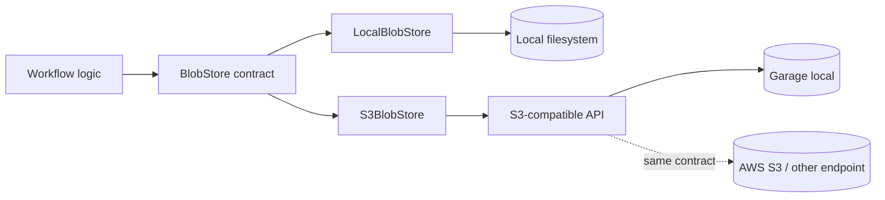
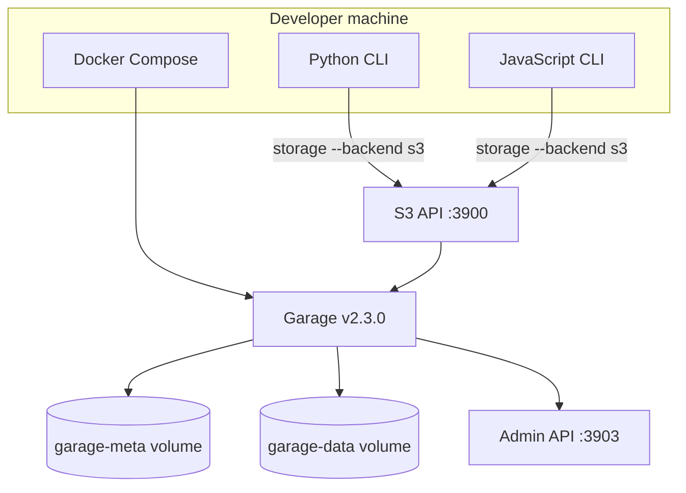

# S3-compatible local object storage

Milestone 3 adds an S3-compatible infrastructure adapter while keeping workflow
logic independent of any particular object-store product.

## Storage architecture



Garage is used only for the disposable local endpoint. The adapter speaks S3,
not a Garage-specific API.

## Local development stack



Both CLIs exercise the same logical storage contract. Docker Compose owns the
local service lifecycle; application code only sees an S3 endpoint.

## Why Garage for the local stack

The repository originally planned to use MinIO for this phase. That is no
longer a good default for a new local stack: MinIO Community Edition moved to
source-only distribution and its upstream repository was archived in 2026.
Garage remains actively developed, publishes an official Docker image, and is
S3-compatible.

The Compose file pins Garage to `v2.3.0` rather than using `latest` so a local
platform rebuild does not silently change its storage server.

## Start the service

From the repository root:

```bash
sh infra/garage/bootstrap.sh
```

Garage v2.3.0 starts with `--single-node --default-bucket`. The Compose service
provides the deterministic development access key, secret key, and
`data-platform-lab` bucket. The bootstrap script therefore only starts the
service and waits until the node reports healthy.

The S3 endpoint is:

```text
http://localhost:3900
```

The admin API is exposed on port `3903` for inspection and future platform
work.

## Load the local development credentials

The repository commits deterministic credentials in `infra/garage/dev.env`.
They are intentionally public and are valid only for this disposable local
stack.

```bash
source infra/garage/dev.env
```

Never reuse these credentials in another environment. Production credentials
belong in a secret manager or the deployment environment, not in Git.

## Python smoke check

```bash
cd python
poetry install
source ../infra/garage/dev.env
poetry run data-platform-lab storage --backend s3
```

The command writes `_platform/smoke.txt`, reads it back, checks existence, and
confirms that the key appears in a prefix listing.

## JavaScript smoke check

```bash
cd javascript
corepack enable
yarn install
source ../infra/garage/dev.env
node src/cli/main.js storage --backend s3
```

JavaScript consumers should `await` storage operations. The local adapter is
synchronous today but is await-compatible; remote S3 operations are naturally
asynchronous.

## Integration validation flow

```mermaid
flowchart LR
    CI[GitHub Actions] --> Start[Bootstrap Garage]
    Start --> Py[Python smoke]
    Py --> Put1[put_bytes]
    Put1 --> Get1[get_bytes]
    Get1 --> Exists1[exists]
    Exists1 --> List1[list_objects]
    List1 --> Js[JavaScript smoke]
    Js --> Put2[putBytes]
    Put2 --> Get2[getBytes]
    Get2 --> Exists2[exists]
    Exists2 --> List2[listObjects]
    List2 --> Pass[Contract validated]
```



The unit suites use injected fake clients to cover pagination, prefixes, and
error classification. This separate flow proves that both runtime adapters also
work against the real S3 wire protocol provided by the local service.

## Target another S3-compatible service

The storage command reads standard AWS credentials plus Data Platform Lab
endpoint settings:

```text
AWS_ACCESS_KEY_ID
AWS_SECRET_ACCESS_KEY
AWS_DEFAULT_REGION
DPL_S3_ENDPOINT_URL
DPL_S3_BUCKET
DPL_S3_KEY_PREFIX   # optional
```

For AWS S3, omit `DPL_S3_ENDPOINT_URL` and use the normal AWS credential chain
in Python or AWS environment credentials in JavaScript. For another compatible
service, set its endpoint URL and matching region.

Custom endpoints default to path-style addressing. This avoids DNS assumptions
in local development and is compatible with the Garage setup in this repo.

## Reset the local object store

The data and metadata live in named Docker volumes. To destroy the local store
and start from an empty state:

```bash
docker compose down -v
sh infra/garage/bootstrap.sh
```

This is destructive by design and should only be used for the local stack.
